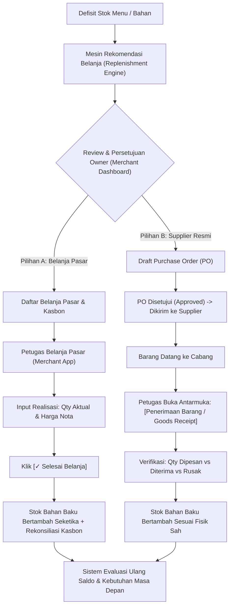

# Xentra — Dual-Track Procurement & Automated Replenishment Architecture Contract v1

**Status:** 🔒 LOCKED DECISION & ARCHITECTURE BLUEPRINT  
**Date:** 2026-10-10  
**Domain:** Inventory, Procurement, Production, Catalog  
**Surfaces:** Owner Merchant Dashboard (`apps/merchant-dashboard/`), Merchant Operating App (`apps/merchant-app/`)

---

## 1. Executive Summary

Xentra membedakan dengan tegas antara **rekomendasi sistem**, **keputusan anggaran belanja**, dan **pencatatan fisik barang**. 

Ketika persediaan menu/produk menipis:
1. Sistem menghitung kebutuhan belanja bahan baku secara otomatis dari defisit target menu $\rightarrow$ ledakan resep (BOM) $\rightarrow$ saldo bahan baku aktual $\rightarrow$ ukuran kemasan & MOQ supplier.
2. Hasil perhitungan berupa **Rekomendasi Pembelian** yang tidak boleh menimpa angka aktual. Rekomendasi disimpan sebagai riwayat acuan (immutability of recommendation).
3. Pengadaan dieksekusi melalui **Satu Modul Pengadaan dengan Dua Jalur (Dual-Track)**:
   - **Jalur A: Belanja Langsung (Pasar / Toko)** — Pembelian tunai/kasbon oleh Petugas Belanja; stok bertambah seketika saat `[✓ Selesai Belanja]`.
   - **Jalur B: Purchase Order (Supplier Resmi)** — Pemesanan terencana ke vendor; stok bertambah **hanya setelah** petugas mengonfirmasi `[Penerimaan Barang / Goods Receipt]`. *(PO disetujui $\ne$ stok bertambah)*.
4. **Selesai Belanja $\ne$ Produksi Menu**: Selesai belanja hanya menambah persediaan bahan baku (Materials). Pengurangan bahan baku dan penambahan produk siap jual terjadi pada transaksi Batch Produksi Dapur (Cooking/Production Batch). Penjualan di POS hanya memotong produk siap jual.

---

## 2. Core Mathematical Pipeline (Replenishment Calculation)

### Step 1: Defisit Target Menu
$$\Delta Q_{\text{menu}} = \max(0, \text{Target Stok Menu} - \text{Stok Saat Ini})$$

### Step 2: Ledakan Resep (Recipe Explosion / BOM)
Untuk setiap bahan mentah $m$ dalam versi resep aktif produk menu:
$$\text{Gross Material Needed}_m = \Delta Q_{\text{menu}} \times \left(\frac{\text{Komposisi Resep}_m}{\text{Yield Resep}}\right)$$

### Step 3: Kebutuhan Bersih Bahan Baku (Net Material Deficit)
$$\text{Effective Stock}_m = \text{Stok Fisik Bahan}_m + \text{PO On-Order}_m - \text{Safety Stock}_m$$
$$\text{Net Deficit}_m = \max(0, \text{Gross Material Needed}_m - \text{Effective Stock}_m)$$

### Step 4: Konversi ke Kemasan & Kebijakan Supplier (Pack Size & MOQ)
Bila bahan terhubung ke `supplier_material_packs` aktif:
$$\text{Packs Needed} = \left\lceil \frac{\text{Net Deficit}_m}{\text{Content Quantity (Pack Size)}} \right\rceil$$
$$\text{Recommended Purchase Packs} = \max(\text{Packs Needed}, \text{Minimum Order Quantity (MOQ)})$$
$$\text{Recommended Purchase Total Qty} = \text{Recommended Purchase Packs} \times \text{Content Quantity}$$

---

## 3. Immutability & Variance Rules (Kurang, Pas, Lebih)

| Kondisi Belanja | Pencatatan Sistem | Dampak Stok Fisik | Penanganan Selisih |
| :--- | :--- | :--- | :--- |
| **Beli Kurang ($-$)** | Qty Rekomendasi: $5$ kg Qty Aktual Beli: $3$ kg | Stok bertambah $+3$ kg setelah penerimaan | Kekurangan $2$ kg **tidak hilang**. Sistem otomatis menghitung ulang sisa kebutuhan pada siklus pengadaan berikutnya. |
| **Beli Tepat ($=$)** | Qty Rekomendasi: $5$ kg Qty Aktual Beli: $5$ kg | Stok bertambah $+5$ kg setelah penerimaan | Kebutuhan terpenuhi. Rekomendasi pembelian berikutnya untuk kebutuhan tersebut menjadi $0$. |
| **Beli Lebih ($+$)** | Qty Rekomendasi: $5$ kg Qty Aktual Beli: $7$ kg | Stok bertambah $+7$ kg setelah penerimaan | Kelebihan $2$ kg sah menjadi aset persediaan bahan baku dan otomatis mengurangi kebutuhan belanja mendatang. |

---

## 4. Dua Jalur Pengadaan (Dual-Track Architecture)

---

## 5. Pemisahan Siklus Hidup: Belanja vs Produksi vs Penjualan

1. **Siklus Belanja (Procurement Lifecycle)**:
   - Input: Kasbon / Hutang Usaha / PO.
   - Output: **Saldo Bahan Baku (Raw Material Stock)** di Stock Location Cabang.
   - **Larangan**: Tidak boleh langsung menambah stok produk siap jual atau mengonsumsi resep.
2. **Siklus Produksi (Cooking / Production Batch Lifecycle)**:
   - Input: Resep aktif + Rencana porsi masak.
   - Mutasi Inventory:
     - Bahan baku berkurang sesuai pemakaian batch.
     - Produk siap jual bertambah sesuai hasil aktual batch.
3. **Siklus Penjualan (Commercial / POS Lifecycle)**:
   - Kasir melayani pesanan customer $\rightarrow$ stok produk siap jual berkurang.
   - Bahan baku **tidak pernah dikurangi dua kali**.

---

## 6. Pembagian Surface & UI

1. **Owner Merchant Dashboard (`apps/merchant-dashboard/`)**:
   - Tab Stok / Pengadaan:
     - Kartu & Tabel **Rekomendasi Belanja Otomatis**.
     - Penjelasan runut: *Defisit Menu $\rightarrow$ Kebutuhan Bahan $\rightarrow$ Stok Tersedia $\rightarrow$ Saran Beli (Pack & MOQ)*.
     - Aksi Owner: `[+ Kirim ke Belanja Pasar]` atau `[+ Buat Purchase Order]`.
2. **Merchant Operating App (`apps/merchant-app/` - Petugas Belanja & Cabang)**:
   - **Subview 1: Belanja Pasar**: Checklist belanja pasar harian, kasbon belanja, kalkulator kembalian, tombol `[✓ Selesai Belanja]`.
   - **Subview 2: PO Supplier & Penerimaan**: Daftar PO aktif (Ordered / In Transit) dengan tombol aksi **[Terima Barang / Goods Receipt]** untuk mencatat fisik datang.
   - **Subview 3: Riwayat**: Transaksi belanja pasar & riwayat penerimaan barang 7 hari terakhir.
   - **Subview 4: Kalkulator**: Kalkulator pasar intuitif.

---

## 7. Penegakan Kontrak Backend (Invariants)

1. **Supplier Pack MOQ Enforcement**:
   - `ProcurementService.createPurchaseOrder` wajib menolak baris PO pack jika `ordered_purchase_quantity < supplier_pack.minimum_order_quantity`.
2. **Immutabilitas Data Rekomendasi**:
   - Record belanja / PO line menyimpan `recommended_quantity` secara terpisah dari `actual_quantity`.
3. **Pemisahan Otoritas**:
   - Petugas `purchasing` di cabang hanya berhak mencatat belanja pasar dan menerima barang (Goods Receipt) untuk cabangnya sendiri (`FORBIDDEN_BRANCH_SCOPE`).
