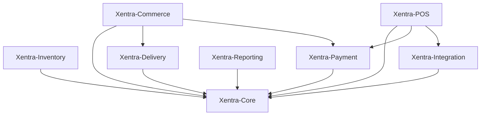

<!-- SNAPSHOT FROM NOTION — source page: 02-domain-blueprint; fetched 2026-09-04 -->

## Responsibilities
- **Core:** identity, organization, owner/brand/branch, authorization/RBAC, permission, shared foundation.
- **Commerce:** customer-facing commerce dan order flow.
- **POS:** operasional transaksi kasir.
- **Inventory:** stok, bahan baku, pergerakan inventory.
- **Payment:** layanan pembayaran lintas domain.
- **Delivery:** tarif ongkir dan pengiriman.
- **Reporting:** pengolahan dan penyajian laporan.
- **Integration:** API pihak ketiga dan hardware.
Physical database/server separation belum dikunci.
## LOCKED BUSINESS FLOW — FINAL AVAILABILITY & PRICE VERIFICATION
When the customer clicks **Pay**, the system performs a final verification before allowing payment to proceed.
### Verification sequence
1. Customer has completed checkout and clicks **Pay**.
2. System shows a loading state while it re-checks the current **availability/stock and price**.
3. If stock and price are still valid, the flow continues directly to payment.
4. If there is any change (price changed, item no longer available, or another relevant order condition changed), payment does not silently proceed. Show a clear popup/message such as **“Ada perubahan di pesananmu, cek dulu yuk”**, update/show the current order condition, and require the customer to review the change before continuing.
### Stock warning / minimum stock
Stock should have a **low-stock threshold/minimum level** so the system can warn when inventory is getting low (example: remaining quantity = 3). The purpose is operational: give the branch an early signal to update/replenish stock before the product actually runs out, reducing customer-facing stock failures.
The exact threshold value is operational/configurable and must not be hard-coded from the example number unless separately decided.
### When stock is actually exhausted
If the product is genuinely unavailable and a customer has already reached a financial transaction state that requires remediation, the business flow must preserve the traceability chain:
**Financial transaction → refund process → stock/unavailability evidence**
The resulting transaction, business log, and system evidence remain traceable for reporting/audit. Stock being exhausted is not a reason to delete or alter historical business/system records.
### Locked principle
**Availability/stock and price are verified at the back of the checkout flow, immediately before payment.** Changes must be surfaced to the customer before payment is allowed to continue; valid conditions proceed to payment.
## LOCKED CLARIFICATION — BRANCH-MANAGER LOW-STOCK THRESHOLD
The previously mentioned quantity such as **3 items** was only an example of a low-stock condition, not a fixed system value.
The actual **minimum/low-stock threshold is configurable from the Branch dashboard**. The **Branch Manager** is authorized to determine how many units of a product should be considered the minimum stock level for that branch.
Therefore the system must automatically use the threshold configured by that Branch Manager when evaluating low-stock conditions and generating the operational warning.
### Context distinction
- Example quantity (e.g. 3) = illustrative only.
- Minimum stock threshold = actual configurable branch data.
- Configuration authority = Branch Manager, within the branch scope.
- System behavior = automatically evaluate current stock against the configured threshold and show the appropriate low-stock warning.
This is a system behavior/configuration requirement and must not be treated as a hard-coded example.
## IMPLEMENTATION AUDIT NOTE — STRICT AVAILABILITY & GUARDED STOCK DEDUCTION
During the latest Git audit of the Commerce implementation, two implementation corrections were identified and are now recorded as completed in Git.
### 1. Strict Branch Product Availability
The previous Commerce implementation had a fallback that treated a missing branch-stock record as a very large available quantity (`999`). This was not appropriate for Xentra's actual business flow because availability must reflect the branch's real stock/assignment state. The fallback has been removed.
The current behavior is strict:
- If the product is not assigned to the branch, it is treated as unavailable.
- If branch stock is absent/null, it resolves to zero/unavailable.
- The system must not manufacture an artificial available quantity when branch stock data is missing.
This is important because the final availability check occurs immediately before payment. Missing stock evidence must therefore fail safely rather than allowing an order to proceed.
### 2. Guarded Stock Deduction in Transaction
Stock deduction during order placement has been moved into a guarded transactional flow so that order creation and stock mutation remain consistent.
The stock update is guarded by the actual remaining quantity condition (`stock >= requested quantity`). If the guarded deduction cannot be performed, the transaction fails and the related order changes are rolled back rather than creating an order whose stock mutation cannot be completed.
Conceptually:
**BEGIN → create order + order items → guarded stock deduction → COMMIT**
If the guarded deduction fails:
**ROLLBACK → no partially committed order/stock state**
This guard is also the final protection against concurrent requests causing stock to go below the available quantity after the pre-payment availability check.
### Audit Context
These changes are implementation alignment with the already-decided Commerce flow: availability and price are verified immediately before payment, while stock integrity must remain protected when the order is actually placed. This note records the implementation state found during Git audit; it does not introduce a new business rule or alter the existing domain boundaries.
## Locked Decision — Payment & Installation Freebie Exception
- `payment_method` default **cash** adalah behavior resmi dan dipertahankan. Jika client tidak mengirim payment method, checkout menggunakan `cash`.
- Payment method resmi Xentra tetap **cash** dan **Midtrans**.
- `promo-es-teh-gratis` adalah **installation freebie resmi**. Setelah instalasi, produk tersebut memang masuk ke checkout dengan harga **Rp0**. Ini adalah pengecualian pricing yang disengaja, bukan bug atau bypass.
- Implementasi saat ini masih mengenali installation freebie melalui special-case identifier (`promo-es-teh-gratis`). Secara arsitektur, pengecualian ini **belum didelegasikan ke modul/domain khusus**.
- Keputusan modular: jangan menghapus atau memblokir behavior Rp0 tersebut. Jika kelak Xentra memiliki sistem promo/freebie yang lebih luas, buat modul/domain khusus dan pindahkan definisi/aturan installation freebie ke sana tanpa mengubah behavior resmi yang sudah berjalan.
- Audit note: special-case `promo-es-teh-gratis` dikategorikan sebagai **technical debt/modularization gap**, bukan security finding.

## 🔒 LOCKED — Promotion Lifecycle & Installation Freebie Business Contract

### Context
Xentra memiliki promotion resmi 'promo-es-teh-gratis' sebagai installation freebie. Promo ini bukan sekadar elemen UI. Promotion memiliki lifecycle terpisah antara discovery, eligibility, entitlement, claim, checkout, final validation, dan redemption.

Masalah implementasi yang sedang ditangani: promo card untuk browser guest/new user dapat tidak muncul, dan fallback frontend berisiko menutupi akar masalah jika promotion discovery authoritative tidak mengembalikan promo.

### Business Decision
Flow promotion resmi Xentra:

DISCOVERY → ELIGIBILITY → ENTITLEMENT → CLAIM → CHECKOUT → FINAL VALIDATION → REDEMPTION

#### Discovery
Guest/browser baru tetap dapat melihat promotion yang memang ditujukan untuk mereka sebagai promotional discovery. Discovery berarti promo dapat ditampilkan, tetapi belum berarti customer sudah memperoleh reward.

Promotion discovery harus berasal dari promotion/business service yang authoritative. Frontend tidak boleh membuat atau menyuntikkan promo palsu hanya karena API kosong/gagal. Jika guest tidak mendapatkan discovery, root cause harus diperbaiki pada discovery/business flow.

#### Eligibility
Setelah requirement promo terpenuhi, misalnya PWA berhasil dipasang, sistem mengevaluasi eligibility. Evaluasi dapat mempertimbangkan promotion aktif, requirement PWA, customer/session, first-order requirement jika berlaku, tenant/brand/branch context, periode promo, dan riwayat redemption.

Eligible ≠ reward sudah berada di cart.

#### Entitlement
Jika eligible, customer memperoleh hak/reward yang dapat diklaim. Untuk installation freebie: Es Teh Gratis, quantity 1, Rp0.

Entitlement adalah keputusan domain/business service, bukan keputusan UI.

#### Claim
Claim berarti memasukkan reward yang sudah entitled ke checkout. Claim bukan redemption order.

Reward harus menjadi bagian dari satu checkout.items[] bersama produk normal. Tidak boleh ada promo cart terpisah.

Reward harus tetap mereferensikan catalog product yang sebenarnya. Installation freebie saat ini diketahui menargetkan product Es Teh dengan product_id 401. Cart line boleh memiliki identity internal/sintetis untuk membedakan promotion reward, tetapi harus menyimpan referensi authoritative ke product_id.

Konsep: cart line identity ≠ catalog product identity.

#### Remove Reward
Jika customer menghapus Es Teh Gratis:
- reward hilang dari checkout.items[];
- produk normal tetap ada;
- entitlement tidak otomatis dianggap redeemed atau forfeited;
- selama entitlement masih valid, promotion kembali menjadi claimable;
- tombol Claim dapat muncul kembali.

Remove cart item ≠ revoke promotion entitlement.

#### Re-Claim
Jika customer menekan Claim setelah reward dihapus, valid entitlement + reward belum ada di checkout → reward dimasukkan kembali ke checkout.items[].

Claim harus idempotent. Jika reward sudah berada di checkout, Claim tidak boleh menambah reward kedua.

#### Final Checkout Validation
Saat customer menekan Pay, sistem melakukan final verification sesuai locked Commerce flow: availability/stock, price, promotion reward validity, customer/session eligibility, product validity, promotion validity, duplicate/redeemed state, dan tenant/brand/branch context.

Browser/localStorage/cart state bukan sumber kebenaran untuk memberikan harga Rp0. Domain/service menentukan apakah reward Rp0 sah.

#### Redemption
Promotion baru dianggap redeemed/consumed ketika order berhasil mencapai business state yang sesuai untuk redemption.

Menghapus reward dari cart sebelum order bukan redemption.

Setelah redemption berhasil, customer tidak boleh memperoleh reward promo yang sama lagi jika rule promo memang one-time.

### State Model
DISCOVERABLE → ELIGIBLE → CLAIMABLE → IN_CHECKOUT → REDEEMED

Remove dari IN_CHECKOUT kembali ke CLAIMABLE selama entitlement masih valid.

IN_CHECKOUT tidak boleh dianggap REDEEMED.

### Architecture Boundary
Promotion/business rules tetap berada pada domain/service yang tepat. Checkout adalah consumer/composition flow, bukan pemilik seluruh business logic promotion.

UI hanya merender promotion view model dan menjalankan action dari application/domain layer. UI tidak boleh menjadi authoritative source untuk eligibility, pricing, redemption, inventory, authorization, atau tenant ownership.

Tidak ada keputusan untuk membuat endpoint Claim baru hanya karena UI memiliki tombol Claim. Jika architecture yang ada dapat memodelkan Claim sebagai conversion dari valid entitlement menjadi cart item, jangan menambah contract baru tanpa alasan teknis/business yang terbukti.

### Implementation Rule
Current Git implementation adalah evidence, bukan otomatis locked business contract. Jika implementation berbeda dari keputusan ini:

Requirement → investigate current behavior → identify root cause → choose implementation → verify

Jangan mempertahankan fallback atau special-case hanya karena sudah ada di Git jika terbukti bertentangan dengan business contract.

### Acceptance Criteria
1. Browser guest/new user dapat menerima promotion discovery jika promo memang berlaku untuk guest.
2. Promo discovery tidak dibuat secara palsu oleh frontend ketika authoritative service gagal.
3. Setelah PWA requirement terpenuhi, eligibility dapat dievaluasi.
4. Eligible customer memperoleh entitlement.
5. Claim memasukkan reward ke checkout.items[].
6. Reward mereferensikan catalog product yang benar dan memiliki promotion metadata.
7. Reward berharga Rp0 hanya jika promotion validation mengizinkannya.
8. Remove reward menghapus hanya reward tersebut.
9. Setelah remove, Claim muncul kembali selama entitlement masih valid.
10. Claim ulang memasukkan reward kembali ke checkout.items[].
11. Double Claim tidak menghasilkan lebih dari satu reward line/entitlement.
12. Reload/state hydration tidak menggandakan reward.
13. Produk normal tidak ikut terhapus.
14. Final payment verification tetap authoritative.
15. Redemption hanya terjadi pada order yang berhasil memenuhi kondisi redemption.

### Verification Rule
Unit test helper saja tidak cukup untuk menyatakan promotion flow selesai.

Verification harus membedakan unit test, integration/execution-path test, deployment verification, dan runtime verification.

Jika runtime/browser interaction belum dapat dibuktikan, status harus ditulis NOT VERIFIED, bukan PASS.

### Decision Summary
Promo card adalah Discovery. Install/requirement menghasilkan Eligibility. Eligibility menghasilkan Entitlement. Claim memasukkan Entitlement menjadi Checkout Item. Remove hanya mengeluarkan item dari cart, bukan mencabut entitlement. Claim ulang memasukkan item kembali. Pay melakukan final validation. Successful order melakukan Redemption.

Ini menjadi business contract untuk installation freebie Xentra dan konteks dasar untuk debugging/implementasi promo berikutnya.
